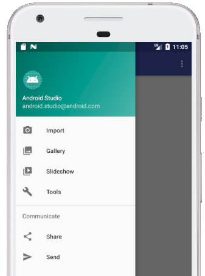
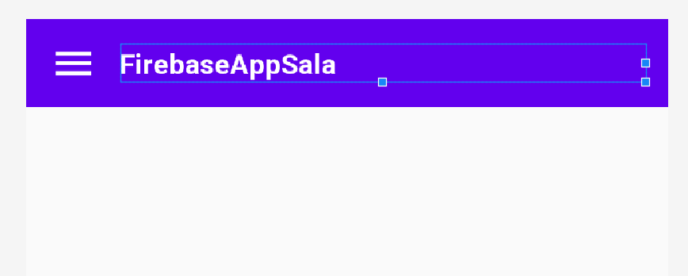
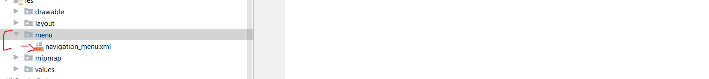
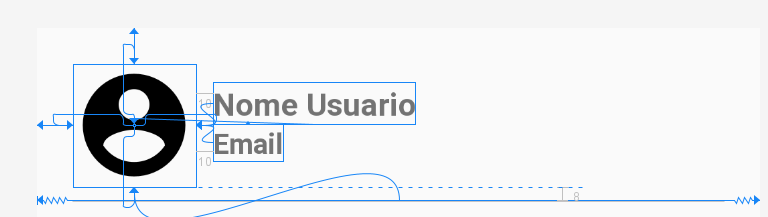
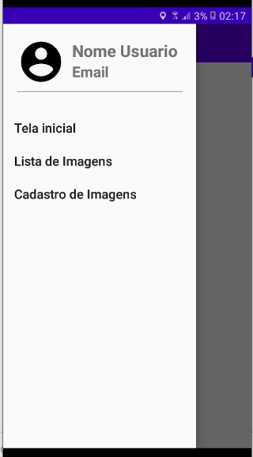

# Drawerlayout:
Link do projeto atual: [Clique aqui!](FirebaseApp-home.zip)
## Dependencias:
- Adicione as seguintes dependencias em ``build.gradle(app)``
```java
dependencies{
    .......
    //Material Design
    implementation 'com.google.android.material:material:1.2.0'

    //Rounded Image View
    implementation 'com.makeramen:roundedimageview:2.3.0'
    //Navigation component
    implementation 'androidx.navigation:navigation-fragment-ktx:2.2.0-rc03'
    implementation 'androidx.navigation:navigation-ui-ktx:2.2.0-rc03'
}
```
## Ícones
- Adicione os seguintes ícones na pasta ``res/drawable``
- ``ic_menu_24dp``:
    ```xml
    <vector android:height="24dp" android:tint="#FFFFFF"
        android:viewportHeight="24.0" android:viewportWidth="24.0"
        android:width="24dp" xmlns:android="http://schemas.android.com/apk/res/android">
        <path android:fillColor="#FF000000" android:pathData="M3,18h18v-2L3,16v2zM3,13h18v-2L3,11v2zM3,6v2h18L21,6L3,6z"/>
    </vector>
    ```
- ``ic_account_circle_black_24dp.xml``
    ```xml
    <vector xmlns:android="http://schemas.android.com/apk/res/android"
            android:width="24dp"
            android:height="24dp"
            android:viewportWidth="24.0"
            android:viewportHeight="24.0">
        <path
            android:fillColor="#FF000000"
            android:pathData="M12,2C6.48,2 2,6.48 2,12s4.48,10 10,10 10,-4.48 10,-10S17.52,2 12,2zM12,5c1.66,0 3,1.34 3,3s-1.34,3 -3,3 -3,-1.34 -3,-3 1.34,-3 3,-3zM12,19.2c-2.5,0 -4.71,-1.28 -6,-3.22 0.03,-1.99 4,-3.08 6,-3.08 1.99,0 5.97,1.09 6,3.08 -1.29,1.94 -3.5,3.22 -6,3.22z"/>
    </vector>
    ```

## Criando layout
- Neste tópico iremos criar um ``NavigationView`` que permite o "efeito gaveta" bem comum em apps:
- 
- Crie uma nova activity chamada ``NavigationActivity.java``. Nesta activity vamos desenhar a toolbar através do XML. Para isso devemos configurar a activity para nao mostrar a toolbar padrão:
    - Crie um novo estilo (``styles.xml``)
    ```xml
    ....
    <style name="NoActionBar" parent="Theme.AppCompat.Light.NoActionBar">
        <item name="colorPrimary">@color/colorPrimary</item>
        <item name="colorPrimaryDark">@color/colorPrimaryDark</item>
        <item name="colorAccent">@color/colorAccent</item>
    </style>
    ```
    - Em ``AndroidManifest.xml`` modifique:
    ```xml
    ....
    <activity android:name=".NavigationActivity"
        android:theme="@style/NoActionBar">
        <intent-filter>
            <action android:name="android.intent.action.MAIN" />
            <category android:name="android.intent.category.LAUNCHER" />
        </intent-filter>
    </activity>
    ....
    ``` 
- Crie o seguinte layout em activity_navigation.xml
    - 
    ```xml
    <?xml version="1.0" encoding="utf-8"?>
    <androidx.drawerlayout.widget.DrawerLayout
        xmlns:android="http://schemas.android.com/apk/res/android"
        xmlns:app="http://schemas.android.com/apk/res-auto"
        xmlns:tools="http://schemas.android.com/tools"
        android:layout_width="match_parent"
        android:layout_height="match_parent"
        tools:context=".NavigationActivity"
        android:id="@+id/nav_drawerLayout"
        >
        <androidx.constraintlayout.widget.ConstraintLayout
            android:layout_width="match_parent"
            android:layout_height="match_parent"
            >
            <LinearLayout
                android:layout_width="0dp"
                android:layout_height="?actionBarSize"
                android:background="@color/colorPrimary"
                android:orientation="horizontal"
                android:paddingStart="15dp"
                android:paddingEnd="15dp"
                android:gravity="center_vertical"
                app:layout_constraintStart_toStartOf="parent"
                app:layout_constraintEnd_toEndOf="parent"
                app:layout_constraintTop_toTopOf="parent"
                >
                <ImageView
                    android:id="@+id/navigation_icon"
                    android:layout_width="30dp"
                    android:layout_height="30dp"
                    android:src="@drawable/ic_menu_24dp"
                    />
                <TextView
                    android:layout_width="match_parent"
                    android:layout_height="wrap_content"
                    android:layout_marginStart="15dp"
                    android:text="@string/app_name"
                    android:textColor="@android:color/white"
                    android:textSize="18sp"
                    android:textStyle="bold"
                    />
            </LinearLayout>
        </androidx.constraintlayout.widget.ConstraintLayout>
    </androidx.drawerlayout.widget.DrawerLayout>
    ```
    - DrawerLayout atua como um container que permite o efeito de "gaveta" interativas que são puxadas de uma ou de ambas as bordas verticais da janela. 
    - O posicionamento do DrawerLayout é controlado pelo atributo  ``android:layout_gravity`` no elemento filho, que define em qual posição a ``View`` irá surgir(esquerda ou direita)
- Crie uma nova pasta ``res/menu`` e um arquivo ``navigation_menu.xml``
    - 
- Código do menu: ``navigation_menu.xml``
    ```xml
    <?xml version="1.0" encoding="utf-8"?>
    <menu xmlns:android="http://schemas.android.com/apk/res/android">
        <item
            android:id="@+id/nav_menu_main"
            android:title="Tela inicial" />
        <item
            android:id="@+id/nav_menu_lista_imagens"
            android:title="Lista de Imagens" />
        <item
            android:id="@+id/nav_menu_cadastro_imagem"
            android:title="Cadastro de Imagens" />
    </menu>
    ```
- Adicione a ``NavigationView`` no DrawerLayout. Ela deve ficar após o Constraint Layout
    ```xml
    .....
        </androidx.constraintlayout.widget.ConstraintLayout>
        
        <com.google.android.material.navigation.NavigationView
            android:id="@+id/navigationView"
            android:layout_width="wrap_content"
            android:layout_height="match_parent"
            app:menu="@menu/navigation_menu"
            android:layout_gravity="start"
            />
        
    </androidx.drawerlayout.widget.DrawerLayout>
    ```
    - O valor ``layout_gravity="start"`` define que a navigation view virá da esquerda para direita. 
- Adicione um novo layout ``res/layout_nav_header.xml``:
    ```xml
    <?xml version="1.0" encoding="utf-8"?>
    <androidx.constraintlayout.widget.ConstraintLayout xmlns:android="http://schemas.android.com/apk/res/android"
        xmlns:tools="http://schemas.android.com/tools"
        android:layout_width="match_parent"
        android:layout_height="match_parent"
        xmlns:app="http://schemas.android.com/apk/res-auto"
        android:padding="20dp">
        <ImageView
            android:id="@+id/nav_header_img"
            android:layout_width="70dp"
            android:layout_height="70dp"
            android:src="@drawable/ic_account_circle_black_24dp"
            app:layout_constraintStart_toStartOf="parent"
            app:layout_constraintTop_toTopOf="parent"
            />
        <View
            android:id="@+id/view"
            android:layout_width="1dp"
            android:layout_height="1dp"
            app:layout_constraintBottom_toBottomOf="@id/nav_header_img"
            app:layout_constraintEnd_toEndOf="@+id/nav_header_img"
            app:layout_constraintStart_toStartOf="@+id/nav_header_img"
            app:layout_constraintTop_toTopOf="@id/nav_header_img"
            />

        <TextView
            android:id="@+id/nav_header_nome"
            android:layout_width="0dp"
            android:layout_height="wrap_content"
            android:text="Nome Usuario"
            android:layout_marginStart="10dp"
            android:textSize="18sp"
            android:textStyle="bold"
            app:layout_constraintBottom_toTopOf="@+id/view"
            app:layout_constraintStart_toEndOf="@+id/nav_header_img" />

        <TextView
            android:id="@+id/nav_header_email"
            android:layout_width="0dp"
            android:layout_height="wrap_content"
            android:text="Email"
            android:layout_marginStart="10dp"
            android:textSize="16sp"
            android:textStyle="bold"
            app:layout_constraintTop_toBottomOf="@+id/nav_header_nome"
            app:layout_constraintStart_toEndOf="@+id/nav_header_img" />
        <LinearLayout
            android:layout_width="0dp"
            android:layout_height="0.1dp"
            android:layout_marginTop="8dp"
            android:background="#6E6A6A"
            app:layout_constraintEnd_toEndOf="parent"
            app:layout_constraintStart_toStartOf="parent"
            app:layout_constraintTop_toBottomOf="@id/nav_header_img"
            />

    </androidx.constraintlayout.widget.ConstraintLayout>
    ```
    - Resultado: 
- Em ``MainActivity.java`` adicione um evento de clique para a Navigation View aparecer ao clicar no botão de menu
    ```java
    public class NavigationActivity extends AppCompatActivity {
        private ImageView btnMenu;
        private DrawerLayout drawerLayout;
        @Override
        protected void onCreate(Bundle savedInstanceState) {
            super.onCreate(savedInstanceState);
            setContentView(R.layout.activity_navigation);

            btnMenu = findViewById(R.id.navigation_icon);
            drawerLayout = findViewById(R.id.nav_drawerLayout);

            btnMenu.setOnClickListener( view -> {
                drawerLayout.openDrawer(GravityCompat.START);
            });
        }
    }
    ```
    - Execute o app. Ele deve ficar da seguinte maneira:
    - 
