# Firebase - Conceitos
Slide: 
Authentication: https://firebase.google.com/products/auth?hl=pt
Firestore: https://firebase.google.com/products/firestore?hl=pt
Storage: https://firebase.google.com/products/storage?hl=pt
# Configurando um projeto no Firebase
- Crie um novo projeto no Firebase (necessário estar logado em um conta google): https://console.firebase.google.com/
- Coloque como nome do projeto **FirebaseApp** e avançe
- Desmarque a opção de Google Analytics e crie o projeto. Após criar o projeto, ele deve ficar da seguinte maneira:
    - 
- Para adicionar um aplicativo no projeto firebase, clique no ícone do android, conforme está marcado na figura acima. Após isso o Firebase irá pedir algumas informações do aplicativo android para registrá-lo:
    - 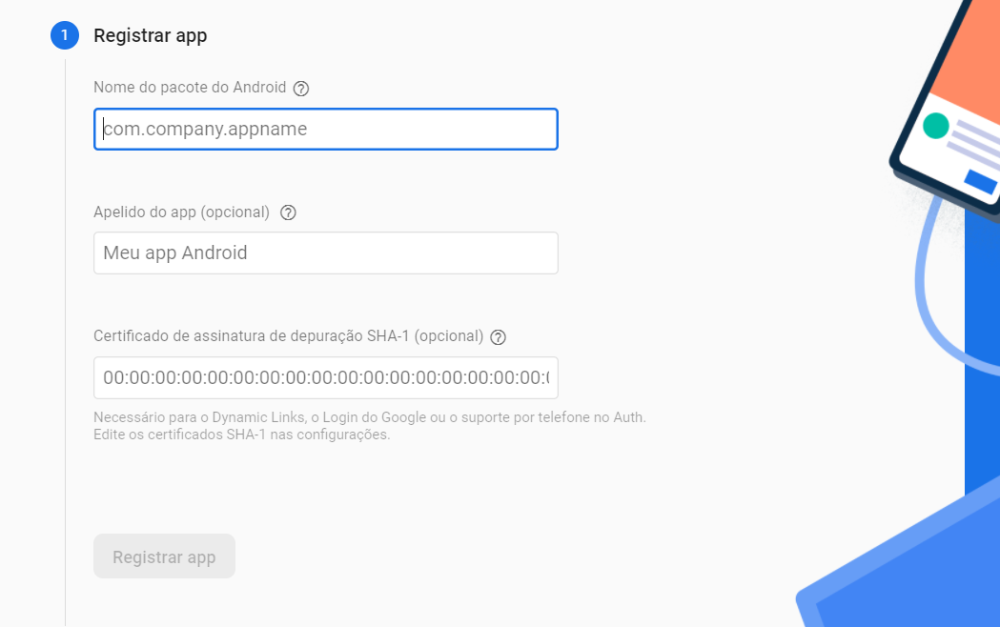
    - O pacote pode ser encontrado no arquivo ``AndroidManifest.xml``
    - O apelido do app. Vamos colocar FirebaseApp
    - O certificado de assinatura vamos gerar no android studio
    - Para gerar o certificado vá na aba lateral: ``Gradle > FirebaseApp > Tasks > Android > signingReport ``:
    - 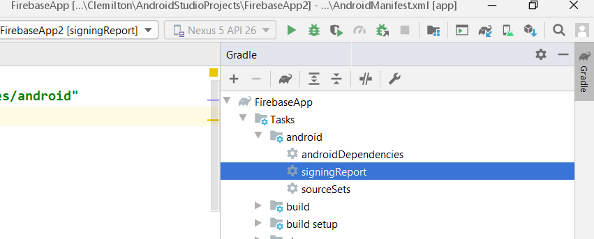
    - O certificado SHA-1 aparecerá na parte inferior do Android Studio:
    - 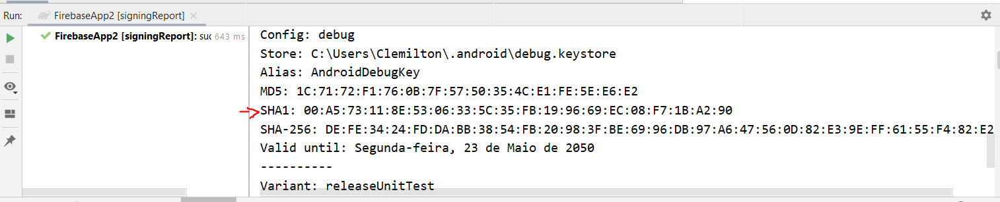
- Registrar o app, precisamos baixar o arquivo google-services.json e colocá-lo na pasta ``app/`` do projeto, conforme mostra a figura:
    - 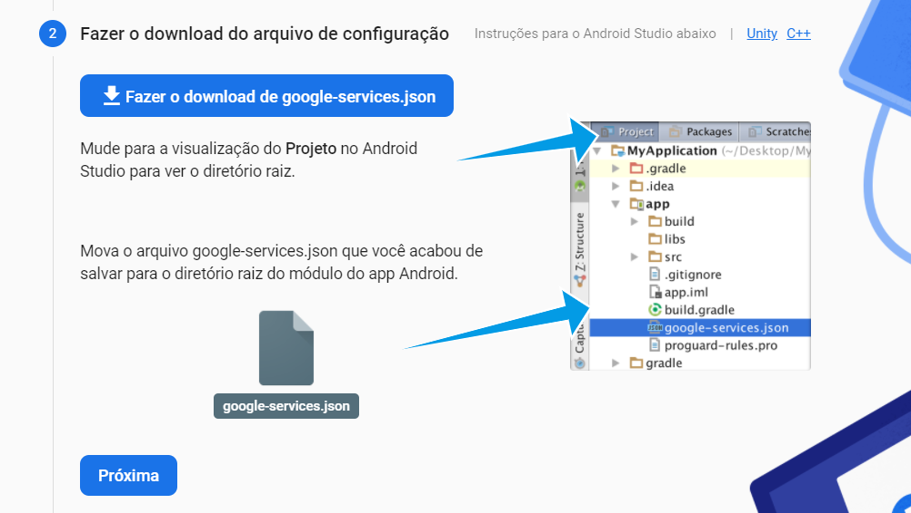
- O próximo passo é configurar os arquivos Gradle para utilizar o SDK Firebase.
    - Primeiro vamos configurar o ``build.gradle(project)``
    - 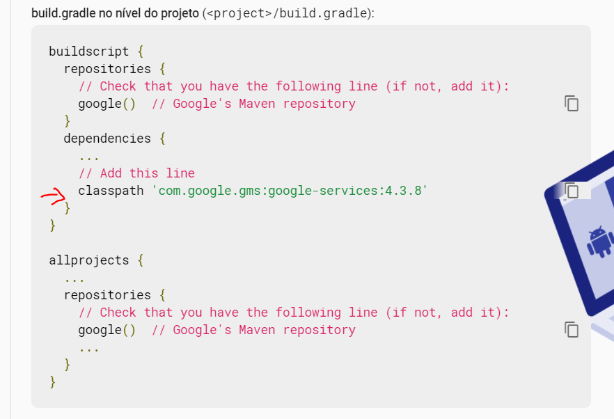
    - Agora vamos configurar o ``build.gradle(app)``
    - 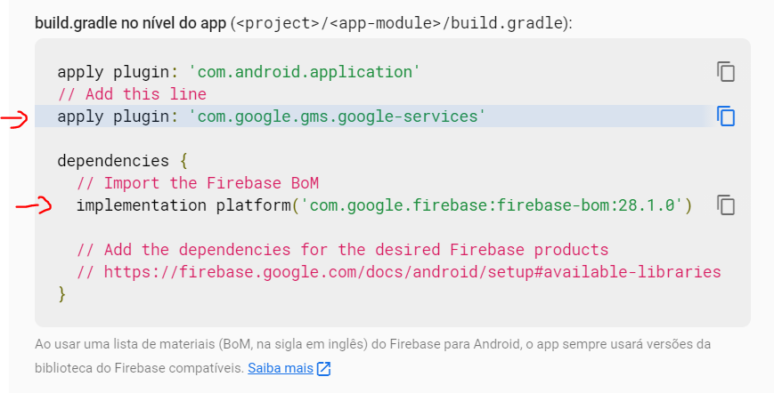
- No link a seguir temos as bibliotecas disponiveis na suite do Firebase: https://firebase.google.com/docs/android/setup#available-libraries.
    - Vamos adicionar as seguintes bibliotecas:
    - 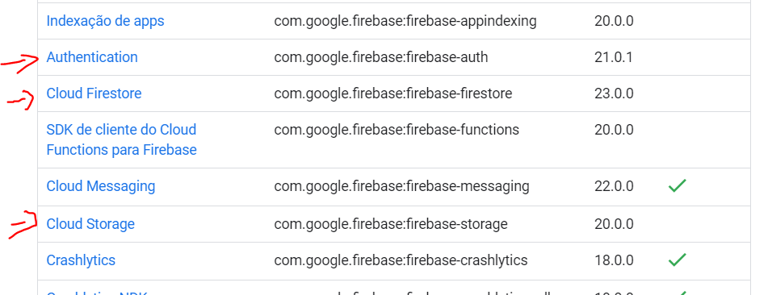
- Adicione as dependencias em ``build.gradle(app)`` e realize sincronize o projeto:
    - 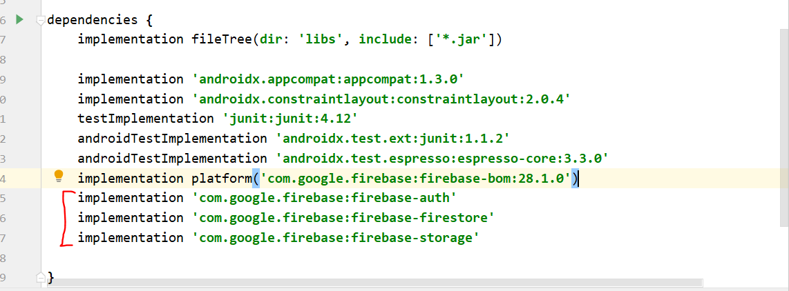

# Authentication
- Agora vamos configurar a parte de autentiticação. Abra no menu do Firebase o opção ``Authentication`` e clique em ``Primeiros Passos``.
- Entre na seção ``Sign-in Method`` e ative a opção de Login com E-mail e senha:
    - 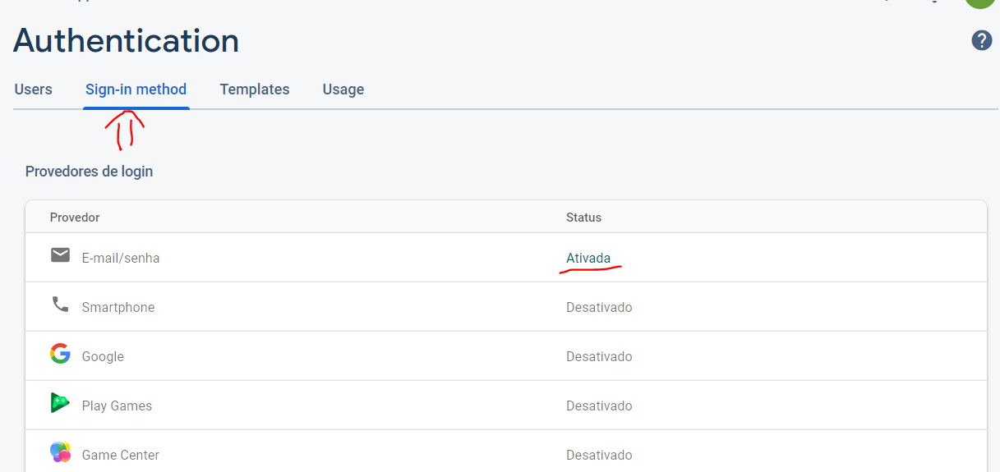
- Agora vamos implementar uma tela de login no Android. Crie uma nova activity ``LoginActivity.java``:
    - 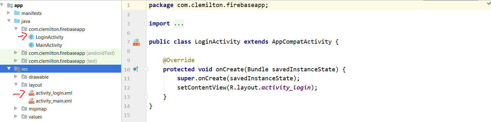
- Adicione um novo estilo em ``styles.xml``:
    ```xml
    <style name="FormStyle">
        <item name="android:layout_width">match_parent</item>
        <item name="android:layout_height">wrap_content</item>
        <item name="android:layout_marginStart">16dp</item>
        <item name="android:layout_marginEnd">16dp</item>
        <item name="android:layout_marginTop">16dp</item>
    </style>
    ```
    - Isso irá ajudar a reaproveitar esses atributos no xml
- Em ``activity_login.xml`` modifique o layout para Linear e adicione um EditText:
    ```xml
    <?xml version="1.0" encoding="utf-8"?>
    <LinearLayout xmlns:android="http://schemas.android.com/apk/res/android"
        xmlns:app="http://schemas.android.com/apk/res-auto"
        xmlns:tools="http://schemas.android.com/tools"
        android:layout_width="match_parent"
        android:layout_height="match_parent"
        android:orientation="vertical"
        tools:context=".LoginActivity">
        <EditText
            android:id="@+id/login_edit_email"
            style="@style/FormStyle"
            android:hint="Digite seu email"
            android:ems="10"
            android:inputType="textEmailAddress" />
    </LinearLayout>
    ```
    - Observe que não foi necessário colocar os atributos ``layout_width`` e ``layout_height`` no código.
- Complete o layout com os seguintes componentes:
```xml
<?xml version="1.0" encoding="utf-8"?>
<LinearLayout xmlns:android="http://schemas.android.com/apk/res/android"
    xmlns:app="http://schemas.android.com/apk/res-auto"
    xmlns:tools="http://schemas.android.com/tools"
    android:layout_width="match_parent"
    android:layout_height="match_parent"
    android:orientation="vertical"
    tools:context=".LoginActivity">
    <EditText
        android:id="@+id/login_edit_email"
        style="@style/FormStyle"
        android:layout_marginTop="64dp"
        android:hint="Digite seu email"
        android:ems="10"
        android:inputType="textEmailAddress" />
    <EditText
        android:id="@+id/login_edit_senha"
        style="@style/FormStyle"
        android:hint="Digite sua senha"
        android:ems="10"
        android:inputType="textPassword" />
    <Button
        android:id="@+id/login_btn_logar"
        android:text="Login"
        style="@style/FormStyle"/>
    <Button
        android:id="@+id/login_btn_cadastrar"
        android:text="Cadastrar"
        style="@style/FormStyle"/>
</LinearLayout>
```
- O layout deve ficar da seguinte maneira: 
    - 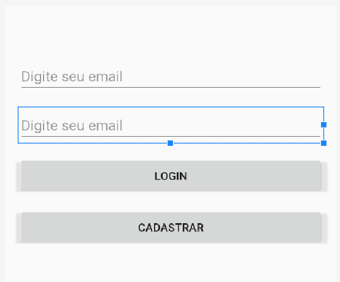
- Em ``LoginActivity.java`` configure o botão para receber um evento de clique:
    ```java
    public class LoginActivity extends AppCompatActivity {
        private Button btnCadastrar;
        @Override
        protected void onCreate(Bundle savedInstanceState) {
            super.onCreate(savedInstanceState);
            setContentView(R.layout.activity_login);
            btnCadastrar = findViewById(R.id.login_btn_cadastrar);

            btnCadastrar.setOnClickListener(new View.OnClickListener() {
                @Override
                public void onClick(View view) {
                    //abrir activity de cadastro
                }
            });
        }
    }
    ```
- Crie uma nova Activity chamado ``CadastroActivity``. Em ``activity_cadadastro.xml`` adicione:
```xml
<?xml version="1.0" encoding="utf-8"?>
<LinearLayout xmlns:android="http://schemas.android.com/apk/res/android"
    xmlns:app="http://schemas.android.com/apk/res-auto"
    xmlns:tools="http://schemas.android.com/tools"
    android:layout_width="match_parent"
    android:layout_height="match_parent"
    android:orientation="vertical"
    tools:context=".LoginActivity">
    <EditText
        android:id="@+id/cadastro_edit_email"
        style="@style/FormStyle"
        android:layout_marginTop="64dp"
        android:hint="Digite seu email"
        android:ems="10"
        android:inputType="textEmailAddress" />
    <EditText
        android:id="@+id/cadastro_edit_senha"
        style="@style/FormStyle"
        android:hint="Digite sua senha"
        android:ems="10"
        android:inputType="textPassword" />
    <Button
        android:id="@+id/cadastro_btn_cadastrar"
        android:text="Cadastrar"
        style="@style/FormStyle"/>
</LinearLayout>
```
- Em ``CadastroActivity.java`` adicione o evento de clique do botão e crie um método cadastrar:
```java
public class CadastroActivity extends AppCompatActivity {
    private Button btnCadastrar;
    private EditText editEmail,editSenha;
    @Override
    protected void onCreate(Bundle savedInstanceState) {
        super.onCreate(savedInstanceState);
        setContentView(R.layout.activity_cadastro);
        btnCadastrar = findViewById(R.id.cadastro_btn_cadastrar);
        editEmail =  findViewById(R.id.cadastro_edit_email);
        editSenha = findViewById(R.id.cadastro_edit_senha);

        btnCadastrar.setOnClickListener(new View.OnClickListener() {
            @Override
            public void onClick(View view) {
               cadastrar();
            }
        });
    }

    public void cadastrar(){
        
    }
}
```
- Faça a verificação no método ``cadastrar()`` do email e da senha:
    ```java
    public void cadastrar(){
        String email = editEmail.getText().toString();
        String senha = editSenha.getText().toString();
        if(email.isEmpty() || senha.isEmpty()){
            Toast.makeText(this, "Preencha os campos",Toast.LENGTH_SHORT).show();
            return;
        }
            
    }
    ```
- Adicione um atributo do tipo ``FirebaseAuth`` para recuperar a instância de autenticação:
    ```java
    public class CadastroActivity extends AppCompatActivity {
        private Button btnCadastrar;
        private EditText editEmail,editSenha;
        //adicionando atributo 
        private FirebaseAuth auth = FirebaseAuth.getInstance();
    ```
    - O método ``getInstance()`` retorna a instância que contem os métodos para controlar a autenticação
- No método ``cadastrar()`` utilize o atributo ``auth`` para cria o usuário:
```java
public void cadastrar(){
    String email = editEmail.getText().toString();
    String senha = editSenha.getText().toString();
    if(email.isEmpty() || senha.isEmpty()){
        Toast.makeText(this, "Preencha os campos",Toast.LENGTH_SHORT).show();
        return;
    }
    //método para criar um usuario com e-mail e senha
    auth.createUserWithEmailAndPassword(email,senha);
}
```
- O método ``createUserWithEmailAndPassword`` funciona de maneira assíncrona. Ou seja, não é possível pegar o resultado de maneira imediata. O Firebase resolve isso através de ``Tasks`` que permitem implementar *listeners* que são executados quando a tarefa tiver retorno de maneira imediata. 
- Um exemplo disso é caso queiramos saber, se o usuário foi criado com sucesso, ou deu algum erro. 

