# Git e Github

## Teoria: https://blog.rocketseat.com.br/iniciando-com-git-github/

## Prática no Terminal
- Abra o aplicativo ``Git Bash``. Esse utilitário pode ser instalado através do site: https://git-scm.com/downloads
- Configure o usuário e o e-mail com que os commits serao registrados. Isso será usado na hora de enviar as alterações para nuvem(github):
    - 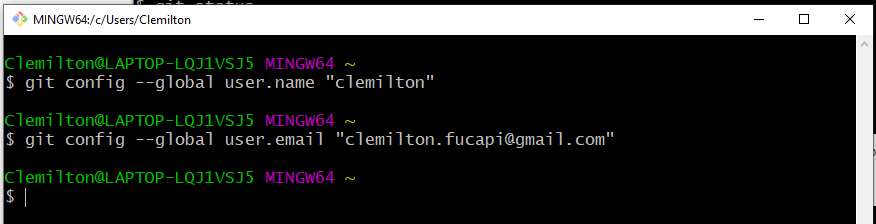
- Digite os seguintes comandos no terminal:
    - 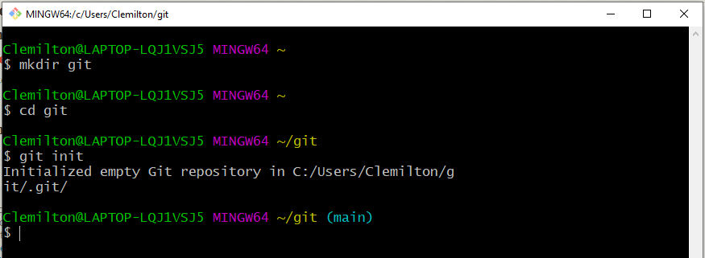
    - ``mkdir``: Cria uma pasta no local onde o terminal está aberto. No windows o git bash abre por padrão na pasta ``C:\Users\NomeDoUsuario``.
    - ``cd``: Comando utilizado para entrar na pasta
    - ``git init``: cria um repositório ``git`` vazio.
- Abra o projeto no vscode e crie um arquivo html:
    - 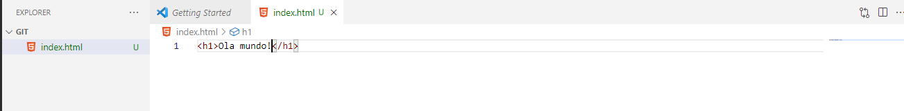
- No terminal digite o seguinte comando: 
    - 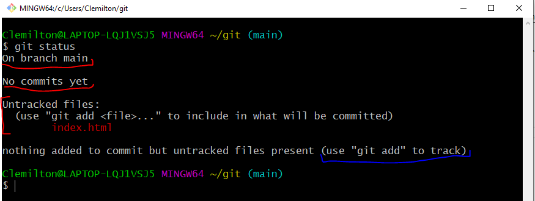
    - ``git status``: Demonstra o estado do repositório e dos arquivos. No caso acima, o terminal nos dá como resposta 3 informações:
        - O repositório está na branch ``main``
        - Não há commits
        - O arquivo ``index.html`` não está rastreado ``untracked``.
- Adicione o arquivo  no próximo commit:
    - 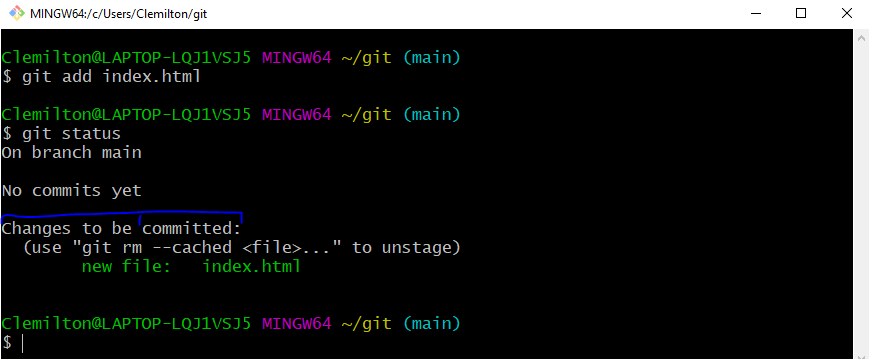
    - ``git add nome_arquivo``: Adiciona o arquivo no próximo commit. Observe que o comando ``git status`` apresenta um resultado diferente.
- Realizar um commit
    - 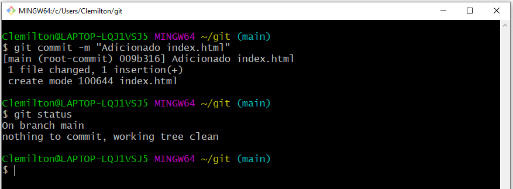
    - ``git commit -m "mensagem``: Cria um novo commit, de maneira local. Observe que este comando retorna um resumo do commit. O comando ``git status`` agora apresenta que não há alterações a serem adicionadas no commit.
- Podemos ver o histórico de commits através do comando ``git log``
    - 
- Agora realizar uma alteração:
    - Modifique o arquivo index.html para:
    ```html
        <h1>Alteracao no index</h1>
    ``` 
    - Crie um novo arquivo chamado ``novo.html``:
    - 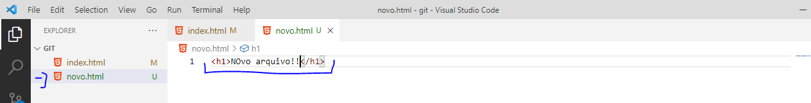
    - Ao ver o status do repositório, temos como retorno que o ``index`` foi modificado e um arquivo ``novo.html`` está não rastread (untracked)
    - 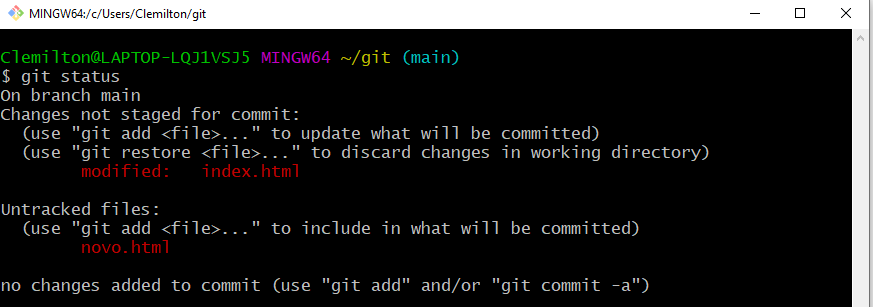
- O comando ``git diff`` mostra as alterações linha a linha dos arquivos, antes de realizar o ``git add``:
    - 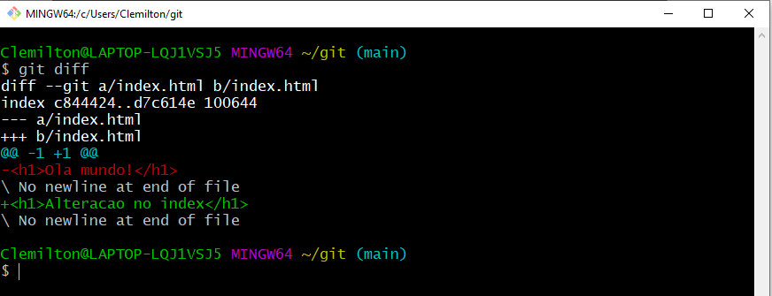
- Adicione os arquivos no prox. commit e realize o commit
    - 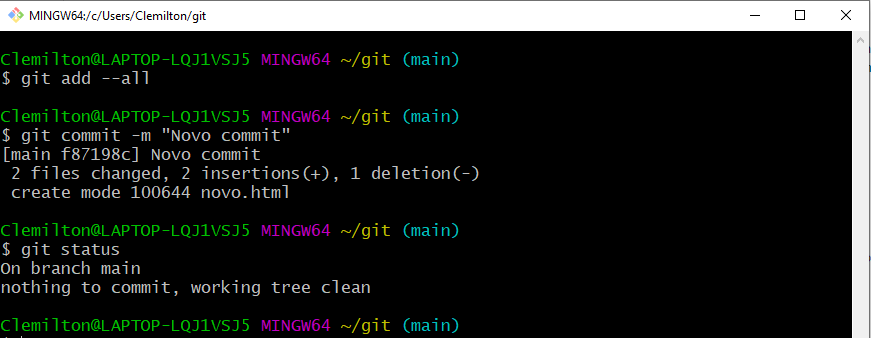
    - ``git add --all``: adiciona todos os arquivos, pastas e subpastas no prox. commit.

# Arquivo .gitignore
- Este arquivo serve para ignorar arquivos ou pastas que não são necessárias na hora de realizar o commit. Um exemplo disso é a pasta ``node_modules`` em um projeto node.js, pois as dependencias já estão no arquivo ``package.json`` e instala-las é fácil
- Digite o comando ``npm init`` para criar um projeto node.js e depois instale o pacote express:
    - 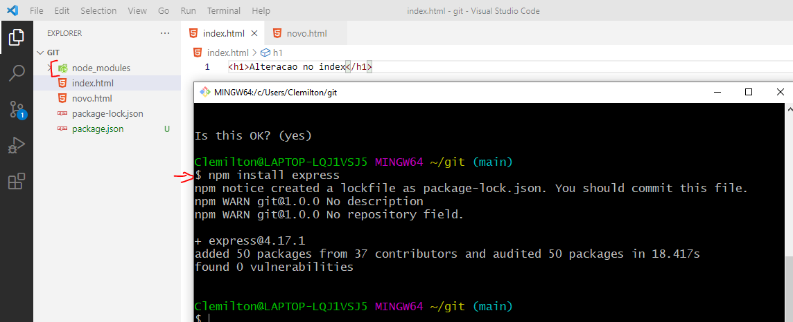
- Crie um novo arquivo chamado .gitignore e coloque no conteúdo:
    ```git
    node_modules/
    ```
- Delete o arquivo ``novo.html`` e digite ``git status``
    - 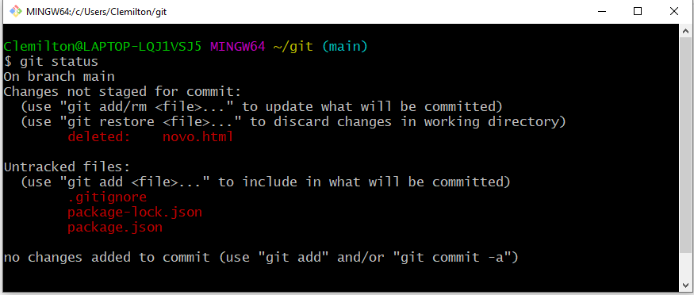
    - Observe que o git identificou que o arquivo ``novo.html`` foi deletado. A pasta ``node_modules/`` não aparece na lista de arquivos não rastreados, por conta do arquivo .gitignore
- Digite os seguintes comandos no terminal:
    - 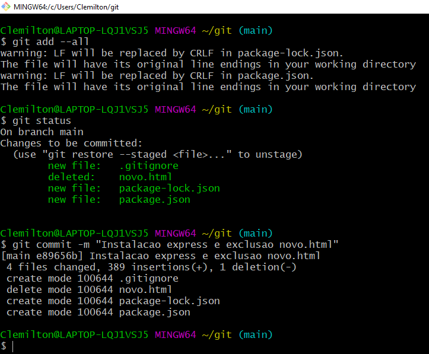
# git checkout
- Vamos supor que queiramos desfazer alguma alteração feita no repositório. Existem algumas formas de fazer isso. Sempre começamos com o comando ``git log``
    - 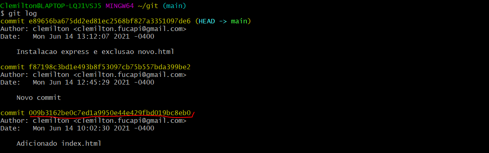
    - Copie o código hash do primeiro commit
- Agora podemos voltar o repositório para o primeiro commmit:
    - 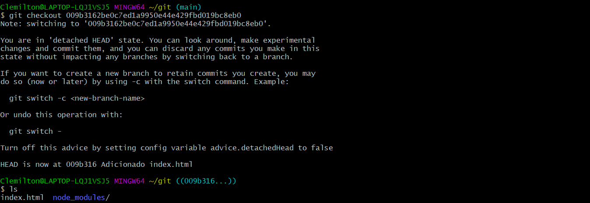
    - ``git checkout``: muda o repositório para um estado anterior do código. Esta operação é recomendada apenas para visualizar o código . Tambem utilizado para ir para outra ramificação(``branch``)
- Para voltar para o repositorio atualizado utilzamos o comando ``git checkout main``

# Github - Repositório remoto
- Primeiro crie uma conta no site:https://github.com/ e crie um novo repositório
    - 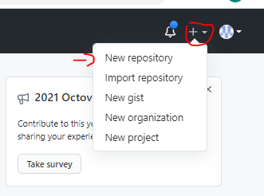
- De o nome para o repositório de **FirebaseApp** e crie o repositório
    - 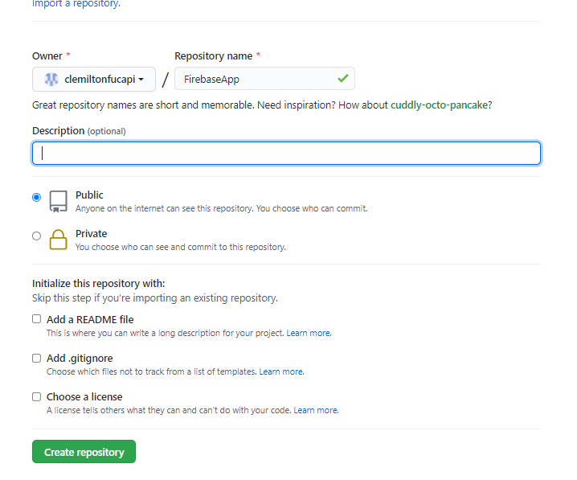
- Copie o link para o repositório remoto
    - 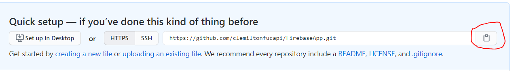
- Adicione o repositório remoto na pasta local:
    - 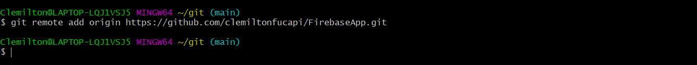
    - ``git remote add origin <url_repo>``: este comando adiciona um repositorio remoto com o nick ``origin``. 
- Para mandar a alteração para nuvem digite o seguinte comando:
    - 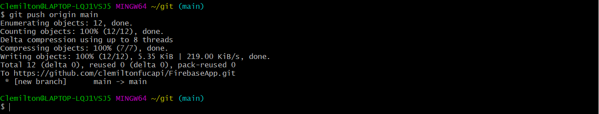
- Veja o repositório online.

# Git Clone
- O comando ``git clone <url>`` faz o download do repositorio:
- Sai da pasta ``git/`` e delete ela e clone o repositorio:
    - 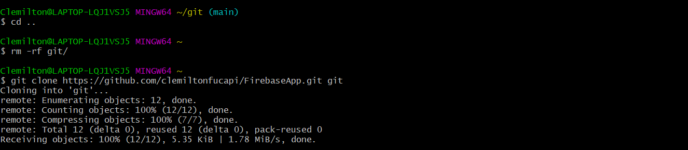
    - ``git clone <url> projeto_firebase/`` clona o repositorio na pasta projeto_firebase
- Verifique se o projeto se encontra na pasta.

# Adicionando README.md
- Vamos adicionar um manual na página inicial do projeto. Vamos fazer essa alteração no próprio site do git:
    - 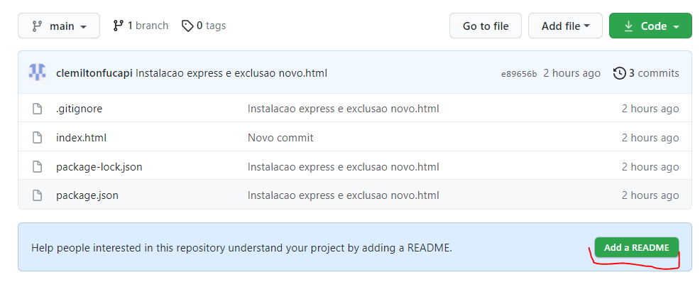
- Escrever no arquivo README.md os comando que mais iremos utilizar:
    - 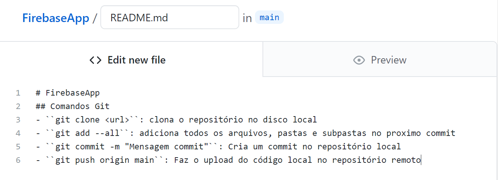
    - Verifique como irá ficar o arquivo README.md na opção PREVIEW
- Realize o commit pelo site:
    - 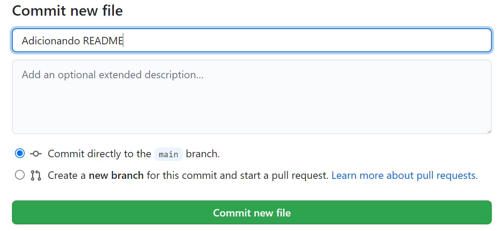